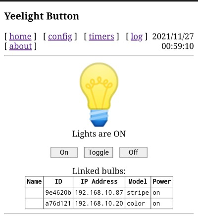
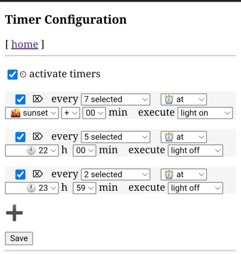
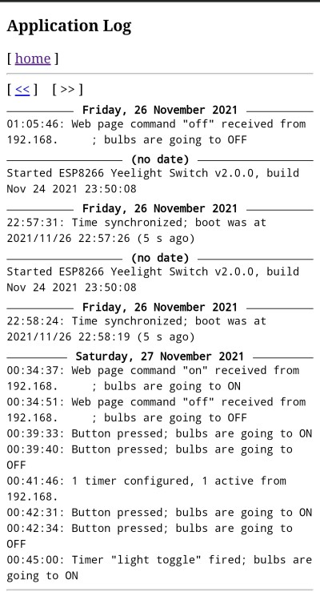
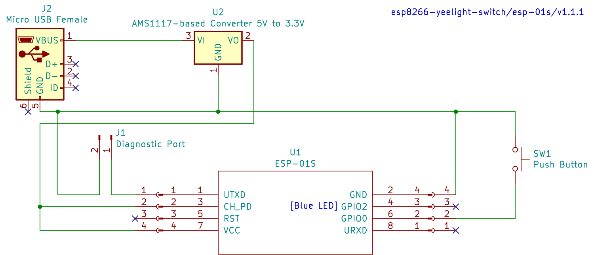

# ESP8266 Yeelight Switch
Arduino project for controlling an Yeelight bulb using an ESP8266 MCU and a push button.

## Features
The program aims to offer a rather complete user experience; this is why in the sketch there's a lot more code than what's needed just to talk to Yeelight. Notable features include:

* Use of local API, meaning nearly instantaneous light switching;
* Support for Yeelight devices discovery on the network;
* Support for multiple bulbs switching at once;
* Rich programmable timer capabilities, including support for sunrise / sunset;
* Visible user feedback using the ESP8266's built-in LED;
* Log of actions;
* Support for Wi-Fi network reconfiguration at run-time; no hard-coded network credentials;
* Web interface with mDNS support to configure the switch;
* Support for turning the bulb on or off via web interface (mobile-friendly), including a direct URL for on/off/toggle;
* Storing of the user-selected light device in EEPROM (survives power off and file system wipe out);
* No hardcoded or entered bulb IP-addresses;
* Detailed diagnostics sent over a serial interface;
* "about" web page showing various run-time information about controller.

Current known limitations:
* A bulb has to be online when the switch boots, otherwise the switch will start unlinked (issue [#2](https://github.com/denis-stepanov/esp8266-yeelight-switch/issues/2));
* The switch is not intended to operate on battery; see issue [#3](https://github.com/denis-stepanov/esp8266-yeelight-switch/issues/3) for more details;
* When working with multiple bulbs, they can act discordantly (issue [#21](https://github.com/denis-stepanov/esp8266-yeelight-switch/issues/21)).

## Usage
1. Review the configuration settings in [MySystem.h](https://github.com/denis-stepanov/esp8266-yeelight-switch/blob/master/MySystem.h); compile and flash your ESP8266;
2. Boot, long press the button until the LED lights up, connect your computer to the Wi-Fi network `ybutton1`, password `42ybutto`, go to captive portal as offered (or try any site), enter and save your Wi-Fi network credentials;
3. Reconnect back to your Wi-Fi network, go to http://ybutton1.local, run the Yeelight scan (`config`) and link the switch to the bulbs found;
4. Use the push button to control your bulbs manually;
5. Access to http://ybutton1.local/?flip to toggle the bulbs from a script. `/?on`, `/?off` work similarly.

In the settings you will need to provide your time zone and geographical coordinates. This is needed to support pre-programmed actions (like turning the light on at sunset). List of supported time zones is available in the ESP8266 Core [TZ.h](https://github.com/esp8266/Arduino/blob/master/cores/esp8266/TZ.h). The location does not have to be precise; a few kilometer precision (one decimal digit after a comma) is good enough. The coordinates are processed locally and are not being sent to any network resource. If you do not know your coordinates, go to [Google Maps](https://maps.google.com), right click on a location and copy a pair of numbers `latitude, longitude`.

If you change the hostname, the password of the bootstrap Wi-Fi network will change too; you can find how it is defined in [System::getNetworkConfigPassword()](https://github.com/denis-stepanov/esp8266-yeelight-switch/blob/master/src/System.cpp).

Default configuration assumes that the button is connected to `GPIO0` (`GPIO4` aka `D2` for Witty Cloud) and is "pulled up" (i.e., the button's second contact is connected to GND). Boards supported out of the box are Witty Cloud, NodeMCU and bare ESP-01S with a wired external button. If your button is connected to a different GPIO, define `BUTTON_BUILTIN` macro accordingly.
 
LED response to the button:
 * 1 blink — bulb flip OK;
 * 1 + 2 blinks — one of the bulbs did not respond;
 * 2 blinks — button not linked to a bulb;
 * 1 long blink — Wi-Fi disconnected.
 
The LED is constantly lit during Wi-Fi reconfiguration process.
 
## Screenshots
* Front page:

 
* Timer configuration example: turn the light on every day at sunset; turn off at 10pm on working days and at midnight on weekends:

 
* Action log, showing bulb manipulations via a button, web page or timer event:
 

 
## Prerequisites
1. Hardware: ESP8266. Tested with:
   1. [ESP-12E Witty Cloud](https://www.instructables.com/Witty-Cloud-Module-Adapter-Board/), Arduino IDE board setting: "LOLIN(WEMOS) D1 R2 and mini";
   2. [ESP-12E NodeMCU](https://www.make-it.ca/nodemcu-details-specifications/), Arduino IDE board setting: "NodeMCU 1.0 (ESP-12E Module)";
   3. [ESP-01S](https://diyprojects.io/esp01-get-started-arduino-platformio-ide-module-choose-pinout/) with an external button, Arduino IDE board settings: "Generic ESP8266 Module"; Flash Size "1MB (FS:256KB)"; Builtin LED: 2
2. Software:
   1. Arduino IDE, https://www.arduino.cc/en/main/software (version tested: 1.8.16);
   2. ESP8266 core for Arduino, https://github.com/esp8266/Arduino (version tested: 3.0.2);
   3. WiFiManager library, https://github.com/tzapu/WiFiManager (version tested: 0.16.0);
   4. JLed library, https://github.com/jandelgado/jled (version tested: 4.7.0);
   5. AceButton library, https://github.com/bxparks/AceButton (version tested: 1.9.1);
   6. Dusk2Dawn library, https://github.com/denis-stepanov/Dusk2Dawn (forked version 1.0.2 — the upstream project's last version 1.0.1 has compilation issues);
   7. ESP-DS-System library, https://github.com/denis-stepanov/esp-ds-system (version tested: 1.1.3 — included with this project in [src/](https://github.com/denis-stepanov/esp8266-yeelight-switch/tree/master/src) folder — no need to install separately).
 

 
Example of connections for an ESP-01S board shown above:
 

 
Here 5V power is provided via micro-USB connector `J2` and is stepped down to 3.3V using convertor `U2`. If you happened to have a 3.3V power supply, you can omit these elements. If you do not care about diagnostic output, you can drop its port `J1` too.
 
## Project Status
27 Nov 2021:
* version 2.0 ready;
* version 2.1 will include most wanted features (such as color / brightness control).
