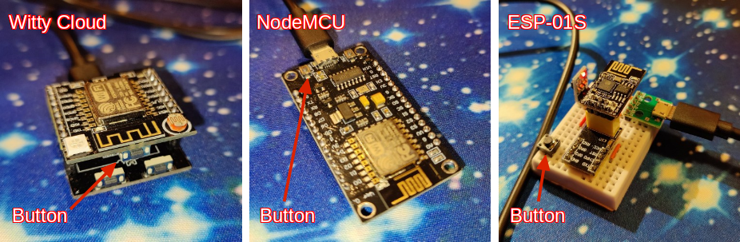

# esp8266-yeelight-switch
Arduino project for controlling an Yeelight bulb using an ESP8266 MCU and a push button.

Program features:
* Use of local API, meaning nearly instantaneous light switching;
* Support for Yeelight devices discovery on the network;
* Support for multiple bulbs switching;
* Visible user feedback using the ESP8266's built-in LED;
* Support for Wi-Fi network reconfiguration;
* Web interface with mDNS support to configure the switch;
* Support for turning the bulb on or off via web interface, including a direct URL for toggle;
* Storing of the user-selected light device in EEPROM (survives power off and file system wipe out);
* No hardcoded or entered bulb IP addresses;
* Detailed diagnostics sent over serial interface;
* "about" web page showing various run-time information about controller.

Current known limitations:
* The bulb has to be online when the switch boots, otherwise the switch will start unlinked;
* The switch is not intended to operate on battery; see issue #3 for more details.

Usage:
 1. review the configuration settings at the top of the program and in MySystem.h; compile and flash your ESP8266;
 2. boot, long press the button until the LED lights up, connect your computer to the Wi-Fi network "ybutton1", password "42ybutto", go to captive portal, enter and save your Wi-Fi network credentials;
 3. in your Wi-Fi network, go to http://ybutton1.local, run the Yeelight scan and link the switch to the bulb found;
 4. use the push button to control your bulb manually;
 5. access to http://ybutton1.local/flip to toggle the bulb from a script.
 
 LED response to the button:
 * 1 blink  - bulb flip OK;
 * 1 + 2 blinks - one of the bulbs did not respond;
 * 2 blinks - button not linked to a bulb;
 * 1 long blink - Wi-Fi disconnected.
 
 The LED is constantly lit during Wi-Fi reconfiguration process.
 
 Prerequsites:
 1. Hardware: ESP8266. Tested with:
    1. [ESP-12E Witty Cloud](https://www.instructables.com/Witty-Cloud-Module-Adapter-Board/), Arduino IDE board setting: "LOLIN(WEMOS) D1 R2 and mini)";
    2. [ESP-12E NodeMCU](https://www.make-it.ca/nodemcu-details-specifications/), Arduino IDE board setting: "NodeMCU 1.0 (ESP-12E Module)";
    3. [ESP-01S](https://diyprojects.io/esp01-get-started-arduino-platformio-ide-module-choose-pinout/) with an external button, Arduino IDE board settings: "Generic ESP8266 Module"; Flash Size "1MB (FS:256KB)"; Builtin LED: 2
 2. Software:
    1. Arduino IDE, https://www.arduino.cc/en/main/software (version tested: 1.8.13);
    2. ESP8266 core for Arduino, https://github.com/esp8266/Arduino (version tested: 3.0.2);
    3. WiFiManager library, https://github.com/tzapu/WiFiManager (version tested: 0.16.0);
    4. JLed library, https://github.com/jandelgado/jled (version tested: 4.7.0);
    5. AceButton library, https://github.com/bxparks/AceButton (version tested: 1.9.1);
    6. LinkedList library(*), https://github.com/ivanseidel/LinkedList (version tested: 1.3.2).

(*) dependency will be removed in version 2.0.0.
 
 If you have an ESP with an onboard button, such as a Witty Cloud Development board, or a NodeMCU, the program can be used out of the box. Otherwise you need to wire your own push button between GPIO0 and GND. If your prefer to use other GPIO, define or update its number in `MySystem.h`
 
 
 
 Example of connections for an ESP-01S board shown above:
 
 
 
 Here 5V power is provided via micro-USB connector `J2` and is stepped down to 3.3V using convertor `U2`. If you happened to have a 3.3V power supply, you can omit these elements. If you do not care about diagnostic output, you can drop its port `J1` too.
 
 26 Sep 2021:
 * version 2.0 is in prepapation, which will mostly concern refactoring and porting to [esp-ds-system](https://github.com/denis-stepanov/esp-ds-system) library;
 * version 2.1 will include most wanted features (such as color / brightness control).
